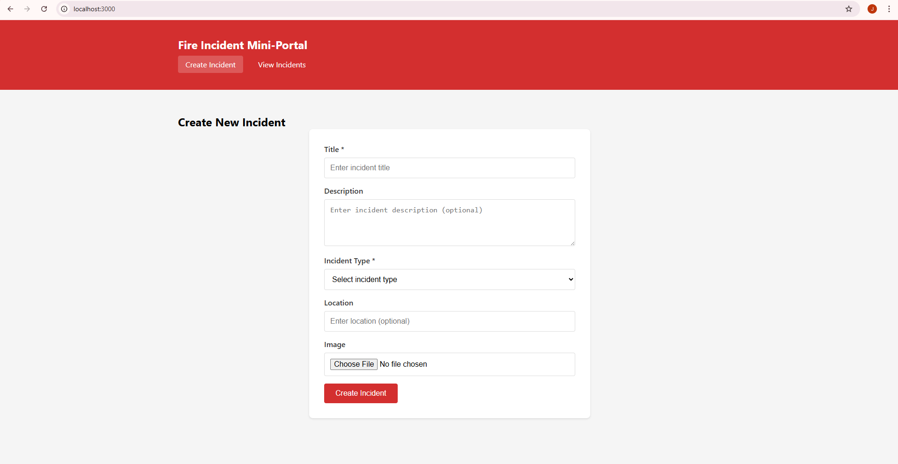
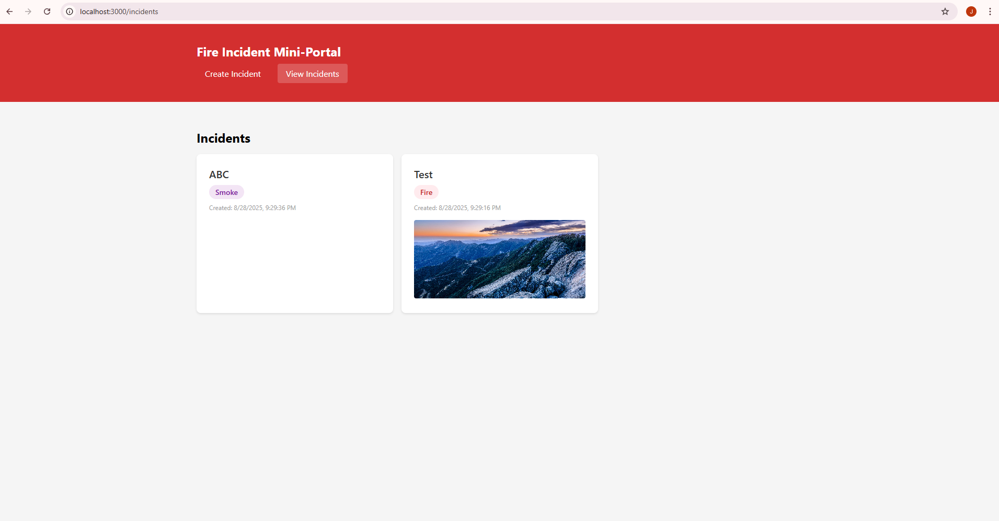

# Fire Incident Mini-Portal

A tiny full-stack application for managing fire incidents, built with Express.js (backend) and React (frontend).




## Features

- **Create Incidents**: Form with validation for creating new fire incidents
- **View Incidents**: Dashboard showing all incidents in reverse chronological order
- **Image Upload**: Support for optional image attachments
- **Data Persistence**: Incidents are stored locally in JSON file
- **File Storage**: Images are saved in the `uploads` folder

## Tech Stack

- **Backend**: Express.js, Multer (file uploads), CORS
- **Frontend**: React, React Router, Axios
- **Storage**: Local JSON file for incidents, file system for images

## Project Structure

```
fire-incident-mini-portal/
├── server.js              # Express server
├── package.json           # Backend dependencies
├── incidents.json         # Data storage (created automatically)
├── uploads/              # Image storage (created automatically)
├── client/               # React frontend
│   ├── package.json      # Frontend dependencies
│   ├── public/
│   │   └── index.html
│   └── src/
│       ├── App.js        # Main app component
│       ├── index.js      # React entry point
│       ├── index.css     # Styles
│       └── components/
│           ├── CreateIncident.js
│           └── ListIncidents.js
└── README.md
```

## Setup Instructions

### Prerequisites

- Node.js (version 14 or higher)
- npm

### Installation

1. **Clone or download the project**

2. **Install backend dependencies**
   ```bash
   npm install
   ```

3. **Install frontend dependencies**
   ```bash
   cd client
   npm install
   cd ..
   ```

### Running the Application

1. **Start the backend server**
   ```bash
   npm start
   ```
   The server will run on `http://localhost:5000`

2. **Start the frontend (in a new terminal)**
   ```bash
   cd client
   npm start
   ```
   The React app will run on `http://localhost:3000`

3. **Access the application**
   Open your browser and go to `http://localhost:3000`

## API Endpoints

### POST /api/incidents
Create a new incident

**Request Body (multipart/form-data):**
- `title` (required): Incident title
- `description` (optional): Incident description
- `incident_type` (required): One of "Fire", "Smoke", "Emergency"
- `location` (optional): Incident location
- `image` (optional): Image file

**Response:** Created incident object

### GET /api/incidents
Get all incidents (latest first)

**Response:** Array of incident objects

### GET /uploads/:filename
Serve uploaded images

## Incident Data Structure

```json
{
  "id": "unique_id",
  "title": "Incident Title",
  "description": "Optional description",
  "incident_type": "Fire|Smoke|Emergency",
  "location": "Optional location",
  "image": "filename.jpg or null",
  "created_at": "2023-01-01T12:00:00.000Z"
}
```

## Features

### Create Incident Page
- Form validation for required fields
- Dropdown with 3 incident types: Fire, Smoke, Emergency
- Optional image upload (max 5MB)
- Success message and auto-redirect

### List Incidents Page
- Grid layout showing all incidents
- Color-coded incident types
- Image thumbnails or filename display
- Reverse chronological order
- Responsive design

## Data Persistence

- Incidents are stored in `incidents.json` file
- Images are saved in the `uploads/` directory
- Data survives browser refresh during the same run
- Files are created automatically on first use

## Development

### Backend Development
```bash
npm run dev  # Uses nodemon for auto-restart
```

### Frontend Development
```bash
cd client
npm start    # React development server with hot reload
```

## Notes

- This is a local development application
- No database setup required
- Images are stored as files on the server
- The application is designed to be simple and functional without polish
- CORS is enabled for local development
